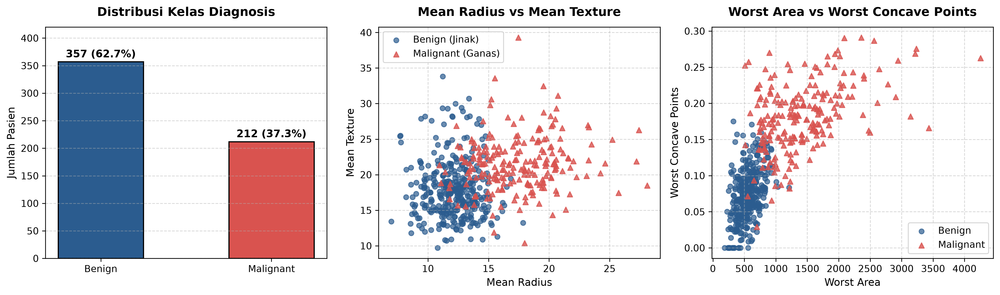
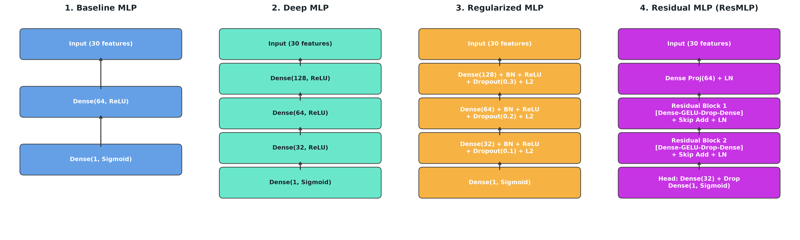
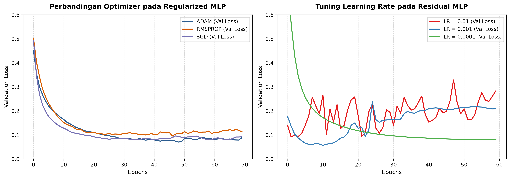
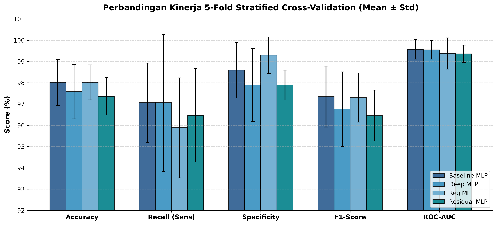
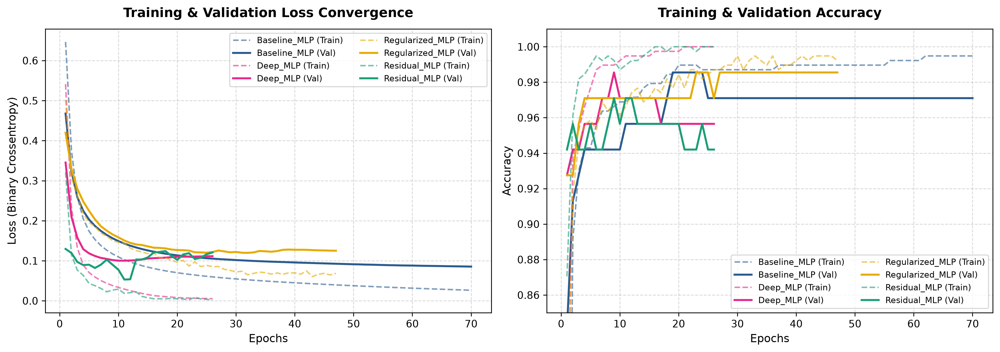
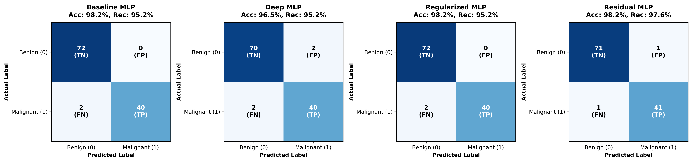
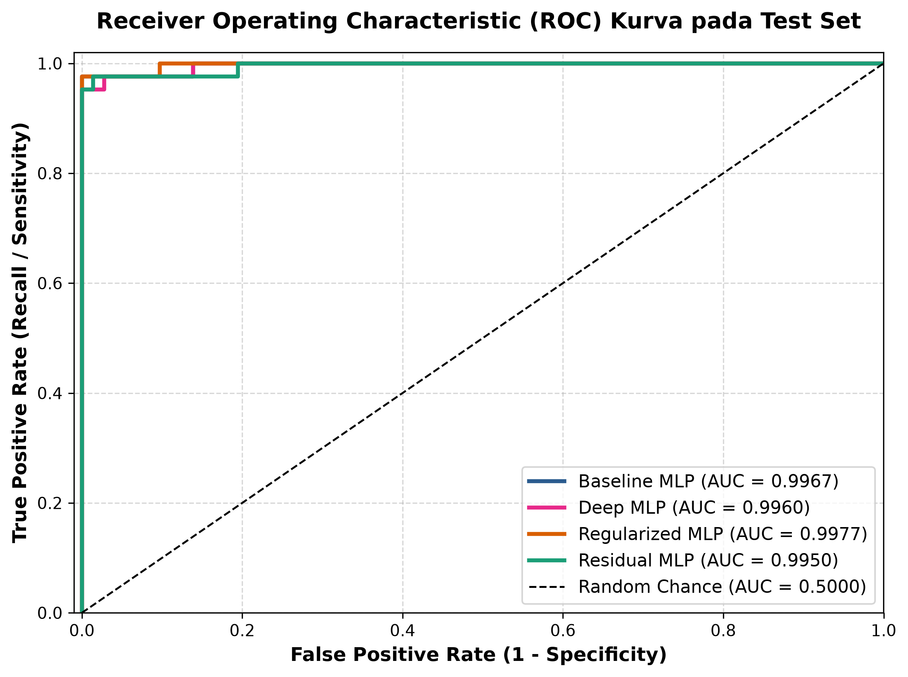

# Group Mini Project: Pembelajaran Mesin Mendalam Lanjut (PMML)

**Mata Kuliah:** Pembelajaran Mesin Mendalam Lanjut (PMML)  
**Dosen Pengampu:** Afiahayati, S.Kom., M.Cs., Ph.D  
**Program Studi:** Magister Kecerdasan Artifisial, Departemen Ilmu Komputer dan Elektronika, FMIPA, Universitas Gadjah Mada  

---

## 👥 Identitas & Pembagian Tugas Kelompok

| No | Nama Anggota | NIM | Peran Utama & Jobdesc |
|:---:|:---|:---:|:---|
| 1 | **FRANS ALWAN PURBA** | **25/563545/PPA/07116** | **Data Preprocessing & Validation Scheme**: Eksplorasi dataset sekunder UCI Breast Cancer, standardisasi fitur (`StandardScaler`) anti-data leakage, perancangan skema *Stratified 5-Fold Cross-Validation*, serta implementasi arsitektur Model 1 (*Baseline Shallow MLP*). |
| 2 | **Muhammad Fikry Rizal** | **25/573936/PPA/07229** | **Deep Learning Architecture & Regularization**: Perancangan *Deep MLP* bertingkat (3 hidden layers), *Regularized Deep MLP* dengan *Batch Normalization*, *Dropout*, dan *L2 Weight Decay*, serta arsitektur mutakhir *Deep Residual MLP* (*ResMLP*) dengan *Skip Connections* dan aktivasi GELU. Eksperimen *Optimizer* dan *Learning Rate Tuning*. |
| 3 | **Sidikara Hakim** | **25/573720/PPA/07221** | **Comprehensive Experiments & Clinical Evaluation**: Evaluasi metrik performa (*Accuracy, Precision, Recall/Sensitivity, Specificity, F1-Score, ROC-AUC*), analisis klinis *False Negative* vs *False Positive*, pembuatan visualisasi saintifik (*Learning Curves, Confusion Matrix, ROC curves*), serta penyusunan slide presentasi 12 halaman dan dokumentasi teknis. |

---

## 🔬 1. Deskripsi Kasus & Signifikansi Klinis (*Problem Case*)

Kanker payudara merupakan salah satu penyebab kematian tertinggi akibat kanker pada wanita di tingkat global. Deteksi dini melalui biopsi jarum halus (*Fine Needle Aspirate* / FNA) memegang peranan krusial dalam menyelamatkan nyawa pasien. Pada prosedur FNA, inti sel diekstraksi dari massa lesi payudara dan dianalisis secara digital untuk menentukan diagnosis:
- **Benign (Jinak / 0)**: Massa non-karsinogenik yang tidak menyebar ke jaringan lain.
- **Malignant (Ganas / 1)**: Tumor kanker yang invasif dan membutuhkan penanganan onkologi segera.

### Tantangan Klinis & Peran Deep Learning
Dalam onkologi klinis, **False Negative (FN)** adalah kesalahan yang sangat berbahaya (pasien kanker ganas dikira tumor jinak, sehingga terlambat menerima kemoterapi/operasi). Sebaliknya, **False Positive (FP)** menimbulkan beban psikologis dan biopsi invasif yang tidak perlu.

Sebanyak 30 parameter morfologis inti sel memiliki hubungan korelasi yang non-linear dan berdimensi tinggi. Oleh karena itu, arsitektur **Deep Neural Network (DNN)** dan **Residual MLP** dikembangkan untuk mempelajari representasi hierarkis fitur secara optimal, mencegah overfitting, dan memberikan probabilitas diagnostik yang akurat dan sensitif.

---

## 📊 2. Deskripsi Data Sekunder & Skema Validasi K-Fold

- **Dataset**: *Breast Cancer Wisconsin (Diagnostic)* dari UCI Machine Learning Repository (Dr. William H. Wolberg, W. Nick Street, Olvi L. Mangasarian).
- **Dimensi**: 569 sampel pasien dengan 30 fitur klinis kontinu.
- **Distribusi Kelas**: 357 Benign (62.7%) dan 212 Malignant (37.3%).
- **Fitur Klinis**: 10 atribut inti (radius, tekstur, keliling, area, kehalusan, kekompakan, kecekungan, titik cekung, simetri, dimensi fraktal) masing-masing dalam 3 nilai statistik (*Mean*, *Standard Error*, dan *Worst*).

```
Total Sampel (569)
├── 80% Train-Val Set (455 sampel) ──> Stratified 5-Fold Cross-Validation (K-Fold)
└── 20% Holdout Test Set (114 sampel) ──> Evaluasi Akhir Unseen Data (72 Benign, 42 Malignant)
```

- **Pencegahan Data Leakage**: `StandardScaler` hanya di-fit pada partisi *training*, kemudian digunakan untuk mentransformasikan *validation* dan *test set*.
- **Stratified K-Fold**: Menjamin proporsi kelas tumor ganas dan jinak tetap identik di setiap lipatan validasi.



---

## 🧠 3. Arsitektur Jaringan Saraf Tiruan (*Neural Networks*)

Kami merancang dan membandingkan 4 arsitektur neural network:

1. **Model 1: Baseline Shallow MLP**
   - 1 Hidden Layer: `Dense(64, activation='relu')`
   - Output: `Dense(1, activation='sigmoid')` (~1,985 parameter)
2. **Model 2: Deep MLP**
   - 3 Hidden Layers: `Dense(128, relu)` $\rightarrow$ `Dense(64, relu)` $\rightarrow$ `Dense(32, relu)`
   - Output: `Dense(1, activation='sigmoid')` (~14,529 parameter)
3. **Model 3: Regularized Deep MLP**
   - 3 Hidden Layers dengan `BatchNormalization` + `Activation('relu')` + `Dropout(0.3, 0.2, 0.1)` + Regularisasi `L2(1e-4)`.
   - Mengatasi *internal covariate shift* dan membatasi memorisasi sampel pelatihan.
4. **Model 4: Deep Residual MLP (Res-MLP)**
   - Linear Projection `Dense(64) + LayerNormalization`
   - 2 Residual Blocks dengan *Skip Connection* (`Add`), `GELU`, `LayerNormalization`, dan `Dropout(0.2)`
   - Menghasilkan *gradient highway* yang mulus dan representasi fitur yang kaya.



---

## ⚙️ 4. Strategi Pembelajaran & Tuning Hyperparameter

- **Loss Function**: *Binary Cross-Entropy Loss*
- **Optimizer Tuning**: Komparasi antara **Adam** (adaptive moments), **RMSprop**, dan **SGD dengan Nesterov Momentum (0.9)**.
- **Learning Rate Search**: Eksplorasi nilai base LR pada $\{0.01, 0.001, 0.0001\}$. Nilai optimal: $\eta = 0.001$.
- **Dynamic Scheduler**: `ReduceLROnPlateau` (factor=0.5, patience=4, min_lr=1e-5) menurunkan learning rate ketika validasi stagnan.
- **Early Stopping**: Patience 12–15 epoch dengan `restore_best_weights=True` untuk mengambil model dengan generalisasi terbaik.
- **Batch Size & Epoch**: Mini-batch size = 32; Epoch maksimum = 70.



---

## 📈 5. Hasil Eksperimen Komprehensif

### A. Kinerja 5-Fold Stratified Cross-Validation (Mean ± Std)
| Model Architecture | Accuracy (%) | Precision (%) | Recall / Sens (%) | Specificity (%) | F1-Score (%) | ROC-AUC |
|:---|:---:|:---:|:---:|:---:|:---:|:---:|
| **Baseline Shallow MLP** | 98.02% (±1.08) | 97.68% (±2.15) | 97.06% (±1.86) | 98.60% (±1.31) | 97.35% (±1.44) | 0.9957 (±0.005) |
| **Deep MLP (Unregularized)** | 97.58% (±1.28) | 96.59% (±2.62) | 97.06% (±3.22) | 97.89% (±1.72) | 96.77% (±1.75) | 0.9955 (±0.004) |
| **Regularized Deep MLP** | **98.02% (±0.82)** | **98.82% (±1.44)** | 95.88% (±2.35) | **99.30% (±0.86)** | **97.30% (±1.16)** | 0.9938 (±0.007) |
| **Residual Deep MLP (ResMLP)** | 97.36% (±0.88) | 96.49% (±1.10) | 96.47% (±2.20) | 97.89% (±0.70) | 96.46% (±1.20) | 0.9936 (±0.004) |



### B. Dinamika Konvergensi & Kurva Pembelajaran (*Learning Curves*)
Deep MLP tanpa regularisasi menunjukkan indikasi overfit di mana gap antara loss train dan loss validation mulai melebar setelah epoch 25. Sebaliknya, Regularized MLP dan Res-MLP mempertahankan kurva validasi yang stabil dan konvergen secara teratur.



### C. Evaluasi pada Hold-out Test Set (Unseen 114 Pasien)
| Model Architecture | Test Accuracy | Test Precision | Test Recall (Sens) | Test Specificity | Test F1 | Test ROC-AUC | FN | FP |
|:---|:---:|:---:|:---:|:---:|:---:|:---:|:---:|:---:|
| **Baseline Shallow MLP** | 98.25% | 100.00% | 95.24% | 100.00% | 0.9756 | 0.9967 | 2 | 0 |
| **Deep MLP** | 96.49% | 95.24% | 95.24% | 97.22% | 0.9524 | 0.9960 | 2 | 2 |
| **Regularized Deep MLP** | **98.25%** | **100.00%** | 95.24% | **100.00%** | **0.9756** | **0.9977** | 2 | **0** |
| **Residual Deep MLP (ResMLP)** | **98.25%** | 97.62% | **97.62%** | 98.61% | **0.9762** | 0.9950 | **1** | 1 |




---

## 🎯 6. Kesimpulan & Rekomendasi Klinis

1. **Keamanan Klinis Tertinggi (Res-MLP)**: Dalam diagnosis medis, meminimalkan *False Negative* adalah prioritas utama. **Residual Deep MLP (Res-MLP)** menghasilkan *Recall / Sensitivitas tertinggi sebesar 97.62%*, hanya menyisakan 1 False Negative dari 42 kasus kanker ganas.
2. **Spesifisitas & Presisi Sempurna (Regularized MLP)**: Regularized MLP mencapai **Presisi 100% (0 False Positive)** dan **ROC-AUC tertinggi (0.9977)**, memastikan pasien tumor jinak tidak mengalami stres psikologis akibat salah diagnosis.
3. **Pentingnya Regularisasi**: Deep MLP murni mengalami penurunan performa (Akurasi 96.49%) akibat overfitting representasi berlebih. Penambahan *Batch Normalization* dan *Dropout* terbukti sangat esensial.
4. **Strategi Pembelajaran Terbaik**: Optimizer **Adam** yang dikombinasikan dengan *ReduceLROnPlateau* dan *Early Stopping* menghasilkan laju konvergensi paling cepat dan stabil.

## 💻 8. Cara Menjalankan Proyek (*How to Run*)

### 1. Kloning Repositori & Instalasi Dependensi
```bash
git clone https://github.com/fransalwan/pmml-mini-project.git
cd pmml-mini-project
pip install -r requirements.txt
```

### 2. Menjalankan Eksperimen Lengkap
```bash
python src/train_eval.py
```
*Output hasil evaluasi JSON akan tersimpan di direktori `results/`.*

### 3. Menghasilkan Grafik Saintifik
```bash
python src/generate_plots.py
```
*7 gambar resolusi tinggi tersimpan di direktori `assets/`.*

### 5. Menjalankan Jupyter Notebook
```bash
jupyter notebook pmml_mini_project.ipynb
```

---

## 📚 9. Referensi Ilmiah

1. **Wolberg, W. H., Street, W. N., & Mangasarian, O. L. (1995)**. Breast Cancer Wisconsin (Diagnostic) Data Set. *UCI Machine Learning Repository*. https://doi.org/10.24432/C5DW2B
2. **He, K., Zhang, X., Ren, S., & Sun, J. (2016)**. Deep Residual Learning for Image Recognition. *IEEE Conference on Computer Vision and Pattern Recognition (CVPR)*, pp. 770-778.
3. **Srivastava, N., Hinton, G., Krizhevsky, A., Sutskever, I., & Salakhutdinov, R. (2014)**. Dropout: A Simple Way to Prevent Neural Networks from Overfitting. *Journal of Machine Learning Research (JMLR)*, 15(1), 1929-1958.
4. **Ioffe, S., & Szegedy, C. (2015)**. Batch Normalization: Accelerating Deep Network Training by Reducing Internal Covariate Shift. *International Conference on Machine Learning (ICML)*, pp. 448-456.
5. **Kingma, D. P., & Ba, J. (2014)**. Adam: A Method for Stochastic Optimization. *International Conference on Learning Representations (ICLR)*. arXiv:1412.6980.
6. **Gorishniy, Y., Rubachev, I., Khrulkov, V., & Babenko, A. (2021)**. Revisiting Deep Learning Models for Tabular Data. *Advances in Neural Information Processing Systems (NeurIPS)*, 34, 18932-18943.
